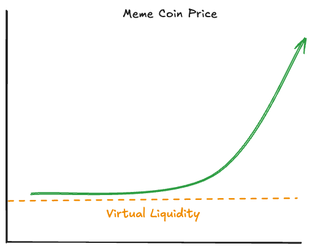
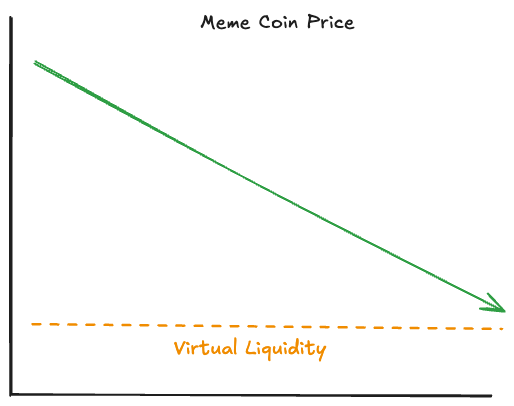
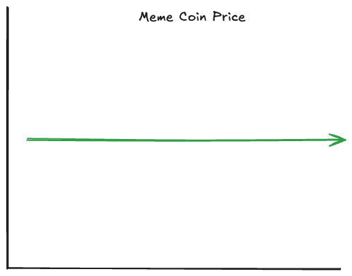

# [Memez.GG](https://www.memez.gg/)

## Memez.GG launchpad supports three modes:

-   **Pump**
-   **Auction**
-   **Stable**

The launchpad is designed to help Meme coins bootstrap liquidity and distribute the tokens to early adopters. The different modes offer different pricing and distribution mechanisms. All the modes revolve around achieving a certain amount of Sui in the pool to bond the coin from the launchpad to a DEX.
All the pools in Memez.GG use Sui as the quote coin and the Meme Coin as the base coin and have no swap fees.
Pools have a creation fee and a bonding fee.

### Pump

In this mode the coin starts at a floor price set by the protocol via virtual liquidity and increases based on the constant product bonding curve - `k = x * y` where `x` and `y` are the token amounts in the liquidity pool. Once the Meme coin price reaches a certain threshold, the pool migrates from our launchpad to a DEX determined by te deployer at pool creation.

This is the standard model used by pump.fun and is the most popular model to bootstrap liquidity for meme coins.

This mode supports the following features:

-   Floor price is set by the protocol admin via virtual liquidity
-   Allows the deployer to be the first buyer in the pool
-   Dynamic burn tax based on the price impact of meme coin sales
-   Developer can only claim his coins after the it bonds
-   Supports the Token standard to prevent pools in DEXs from being created before the coin bonds

### Auction

This mode mimics a dutch auction. The protocol provides liquidity to the pool linearly. By increasing the amount of the Meme coin in the pool, it lowers its price as defined by the constant product invariant - `k = x * y`. In this mechanism, the price starts at a very high price and decreases over time linearly for 30 minutes until it hits a floor price based on the virtual liquidity set by the protocol. In this mode, the traders have the opportunity to decide at which market the coin should bond.

This mode supports the following features:

-   Initial auction price and floor price are set by the protocol admin
-   The deployer get's a percentage of meme coin supply after migration
-   Developer can only claim his coins after the it bonds
-   Supports the Token standard to prevent pools in DEXs from being created before the coin bonds

### Stable

This mode provides the safest option for users as the price of the coin is constant. Users can buy and sell at the same price anytime before it bonds.

This mode supports the following features:

-   Constant price
-   The deployer can choose his allocation and vesting period.
-   Developer can only claim his coins after the it bonds
-   Supports the Token standard to prevent pools in DEXs from being created before the coin bonds
